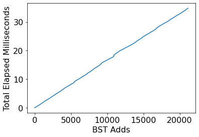
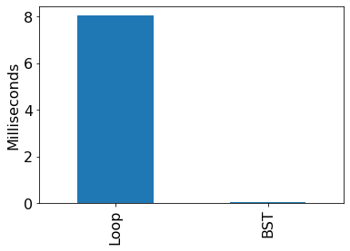

# Loan Analysis

## Overview

Sadly, there is a long history of lending discrimination based on race
in the United States.  Lenders have literally drawn red
lines on a map around certain neighbourhoods where they would not
offer loans, based on the racial demographics of those neighbourhoods
(read more about redlining here: https://en.wikipedia.org/wiki/Redlining).
In 1975, congress passed the Home Mortgage Disclosure Act (HDMA) to
bring more transparency to this injustice
(https://en.wikipedia.org/wiki/Home_Mortgage_Disclosure_Act).  The
idea is that banks must report details about loan applications and
which loans they decided to approve.

The public HDMA dataset spans all the states and many years, and is documented here:
* https://www.ffiec.gov/hmda/pdf/2020guide.pdf
* https://cfpb.github.io/hmda-platform/#hmda-api-documentation

In this project, I will analyze every loan application made in Wisconsin in
2020.

Things I will practice:
* classes
* large datasets
* trees
* testing
* writing modules

## Results

Results will be in 4 files:
* p2.ipynb
* loans.py (first module developed in lab)
* module_tester.py
* search.py (second module developed in lab)

## First Home Bank Analysis

For the following questions, created a `Bank` object for the bank named "First Home Bank".

### Q1: what is the average interest rate for the bank?

Skip missing loans where the interest rate is not specified in your calculation.

### Q2: how many applicants are there per loan, on average?

### Q3: what is the distribution of ages?

Answer with a dictionary, like this:

```
{'65-74': 21, '45-54': 21, ...}
```

### Tree of Loans for Q4 and Q5

For the following questions, create a `BST` tree.  Loop over every loan in the bank, adding each to the tree.  The `key` passed to the `add` call should be the `.interest_rate` of the `Loan` object, and the `val` passed to `add` should be the `Loan` object itself.

### Q4: how many interest rate values are missing?

Don't loop over every loan to answer.  Use your tree to get and count loans with missing rates (that is, `-1`).

### Q5: how tall is the tree?

The height is the number of nodes in the path from the root to the deepest node.  Write a recursive function or method to answer.


## Part 4: University of Wisconsin Credit Union Analysis

Build a new `Bank` and corresponding `BST` object as before, but now for "University of Wisconsin Credit Union".

### Q6: how long does it take to add the loans to the tree?

Answer with a plot, where the x-axis is how many loans have been added so far, and the y-axis is the total time that has passed so far.  You'll need to measure how much time has elapsed (since the beginning) after each `.add` call using `time.time()`.

**Note:** performance and the amount of noise will vary from one virtual machine to another, so your plot probably won't be identical (this applies to the other performance plots too).



### Q7: how fast are tree lookups?

Create a bar plot with two bars:
1. time to find missing `interest_rate` values (`-1`) by looping over every loan and keeping a counter
2. time to compute `len(NAME_OF_YOUR_BST_OBJECT[-1])`



### Q8: How many applicants indicate multiple racial identities?

Answer with a bar graph, where the y axis should represent the number of applicants with the corresponding x-axis represents number of race selections.

### Q9: How many leaf nodes are in the tree?
Write a recursive function or method to count the number of leaf nodes present in the given BST.

### Q10: What is the second largest interest rate in the Bank BST?

**Hint:** you could write a recursive function or method that can return the top 2 (or N) keys for any subtree.
